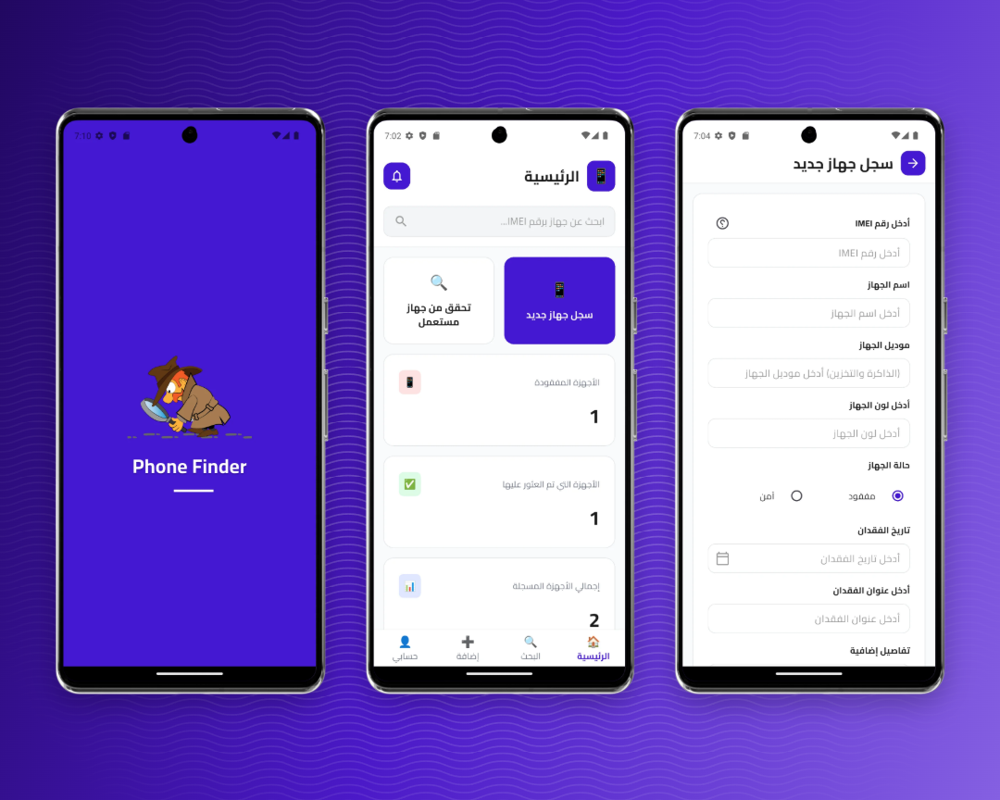
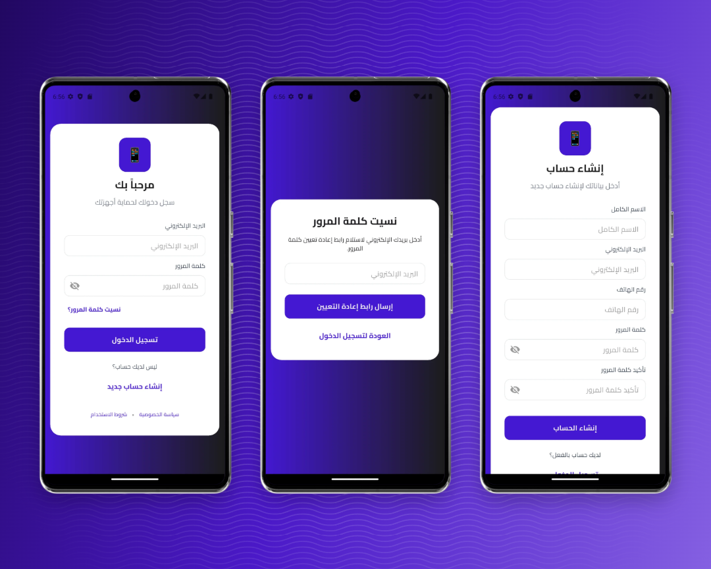
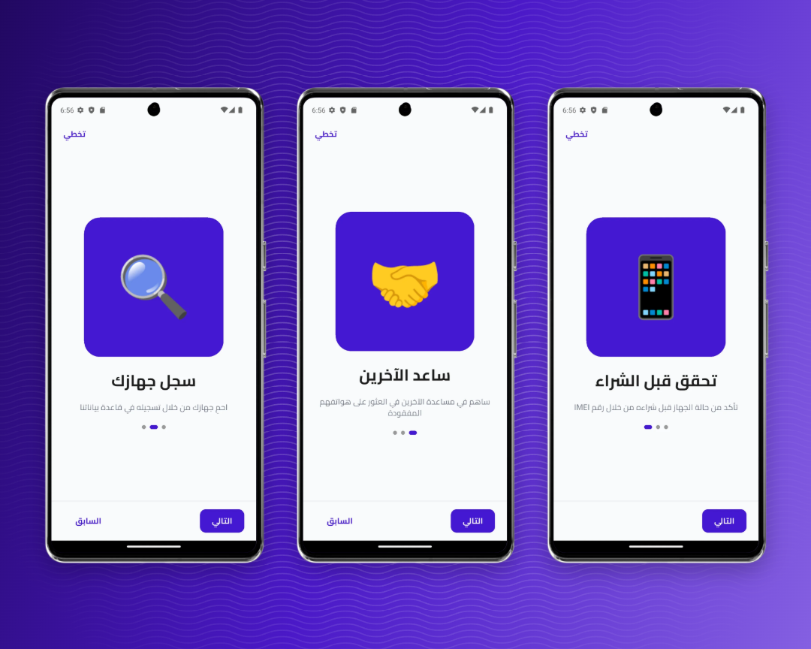
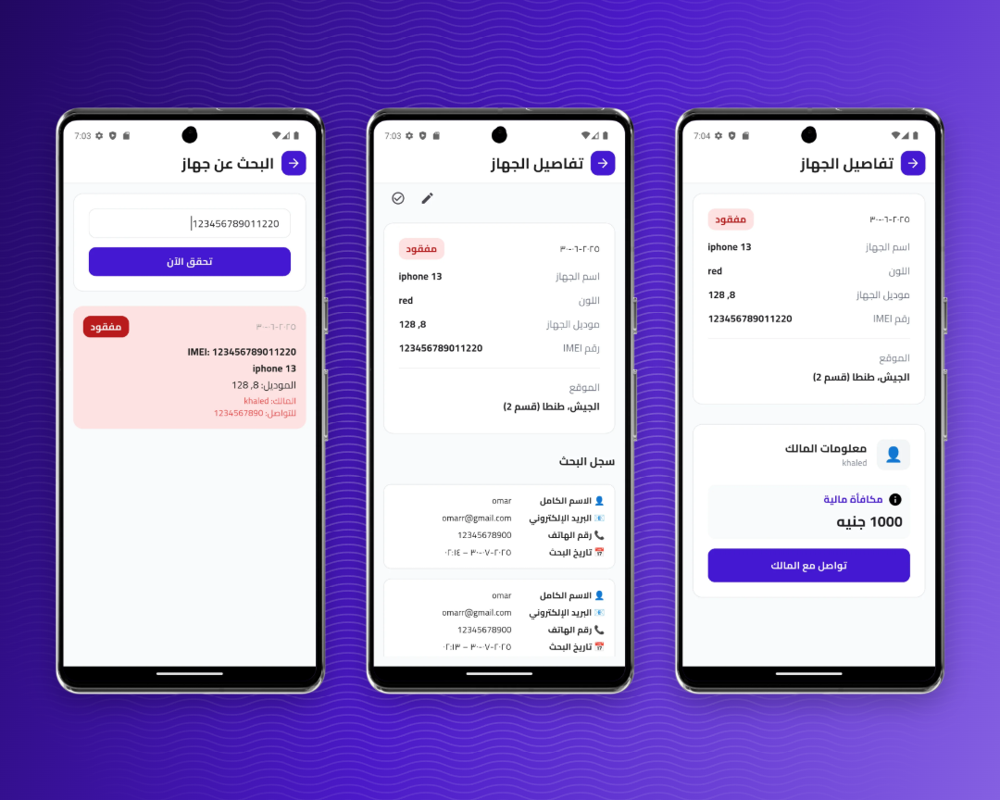
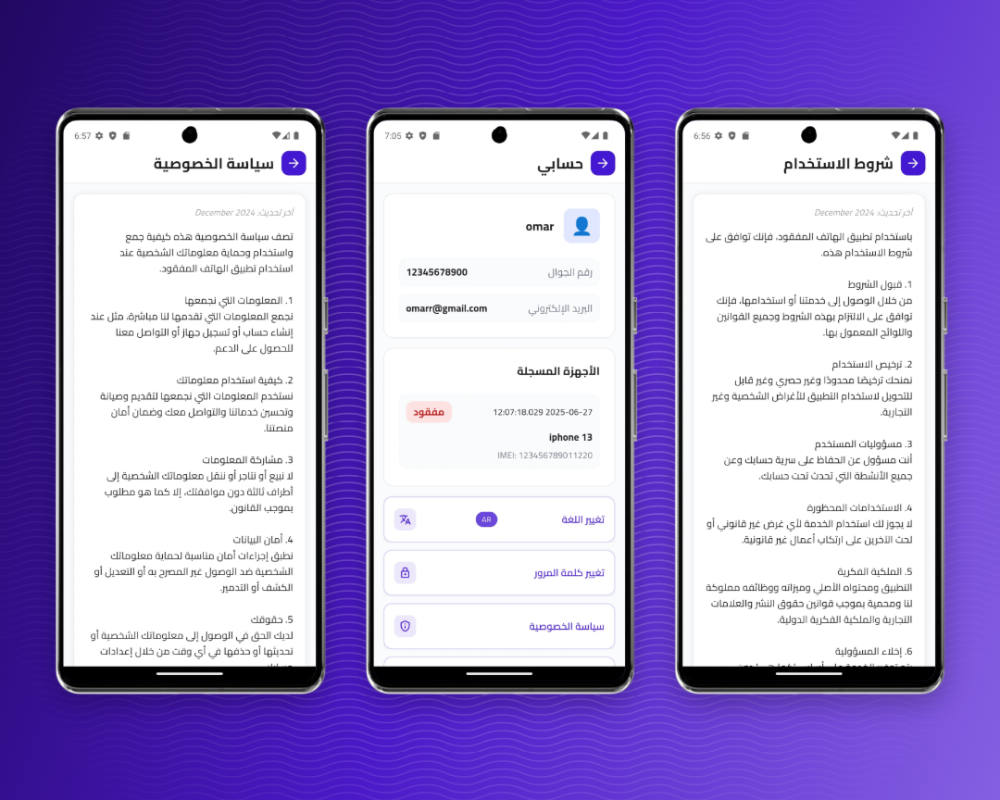

  

<h1 align="center">Find My Phone</h1>

  <a href="https://3khaled3.github.io/find_my_phone_landing/">
    🌐 View Landing Page
  </a>

A cross-platform Flutter app to help users register, track, and recover lost or stolen mobile devices using their IMEI number. The app leverages Firebase for authentication, data storage, push notifications, and analytics, and supports both English and Arabic languages.

---

## 🚀 Features

- **Device Registration:** Register your devices with IMEI, model, color, and status (safe/lost).
- **IMEI Search:** Instantly check the status of any device by its IMEI before buying or selling.
- **Lost Device Reporting:** Mark devices as lost, add details, and offer a reward for recovery.
- **Device Tracking:** View search history and analytics for your devices.
- **Push Notifications:** Receive real-time notifications about device status and search events.
- **User Profile:** Manage your account, registered devices, and change password or language.
- **Analytics Dashboard:** See statistics on lost, found, and registered devices.
- **Multi-language Support:** English and Arabic UI with easy language switching.
- **Onboarding:** Guided onboarding for new users.
- **Offline Support:** Local storage for some data using Hive.
- **Privacy Policy & Terms of Use:** Comprehensive legal documents accessible from login, register, and profile screens.

---

## 📸 Screenshots

| Home Screen | Features |
|---|---|
|  |  |

| Tracking View | Settings |
|---|---|
|  |  |

| Alert Screen |
|---|
|  |

## 📲 Download

| Platform | Download Link |
|---|---|
| **Android APK** | [Download Phone_Finder.apk](Phone_Finder.apk) |

---

## 📂 Project Structure

- `lib/app/` — Main app features (device, auth, home, notification, analytics, profile, search, onboarding)
- `lib/core/` — Core utilities (constants, localization, themes, router, services)
- `assets/` — Fonts, images, and Firebase config
- `android/`, `ios/`, `web/`, `macos/`, `linux/`, `windows/` — Platform-specific code

---

## 🧰 Technologies Used
- **Flutter** (Dart)
- **Firebase** (Auth, Firestore, Storage, Messaging)
- **Hive** (local storage)
- **BLoC/Cubit** (state management)
- **Google Maps** (device location)
- **Push Notifications** (Firebase Messaging, Local Notifications)
- **Multi-language** (intl, flutter_localizations)

---

## 🌍 Localization
- English and Arabic supported
- Easily switch language from the profile screen
- Privacy Policy and Terms of Use available in both languages

---

## 📋 Legal & Compliance
- **Privacy Policy:** Comprehensive privacy policy covering data collection, usage, and user rights
- **Terms of Use:** Detailed terms of service including user responsibilities and app usage guidelines
- Both documents are accessible from:
  - Login screen (bottom links)
  - Registration screen (bottom links)
  - Profile screen (dedicated buttons)

